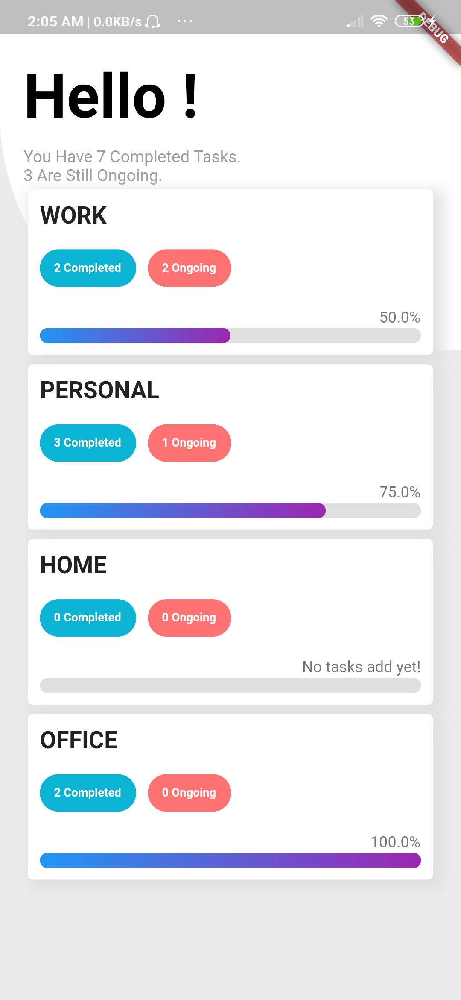
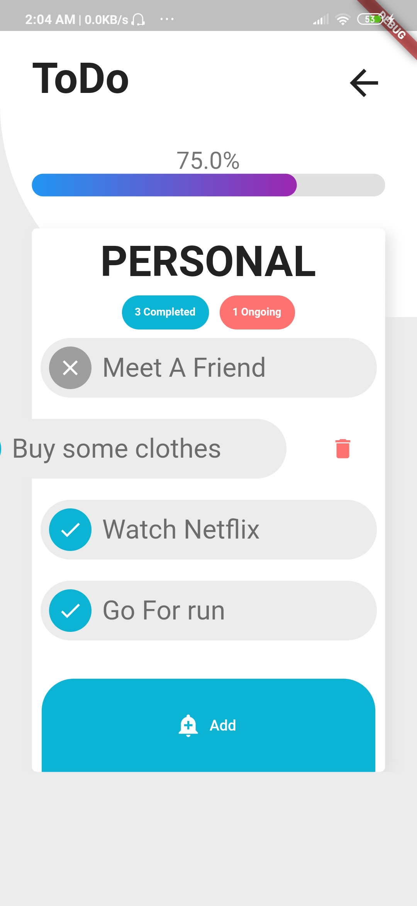
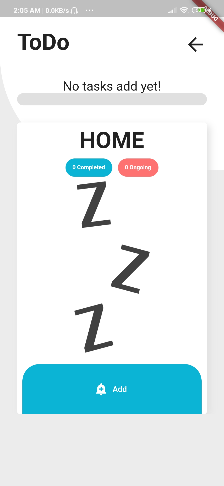

<h1 align="center">
 
  Todo APP
   
</h1>

<h4 align="center">A minimal Todo mobile app made using <a href="https://flutter.dev" target="_blank">Flutter</a>.</h4>

  
   
  

## Key Features

* Easily add and remove tasks
* Organize tasks under categories.
